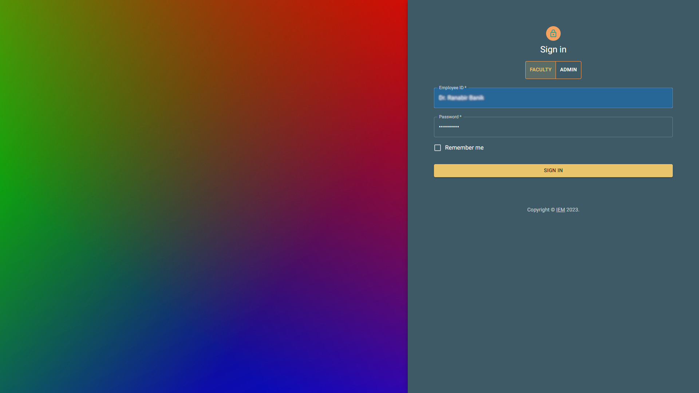
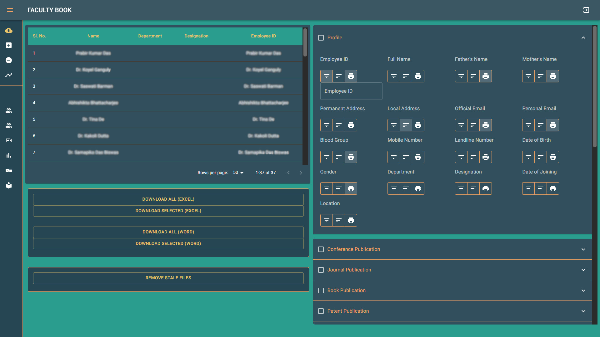
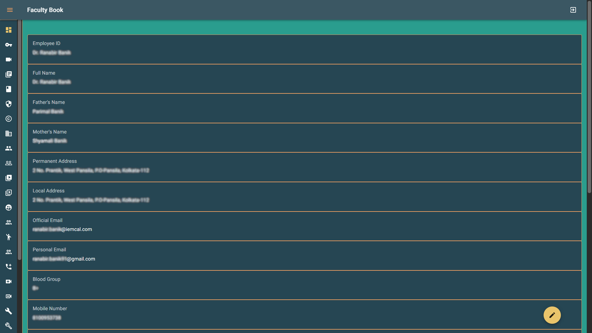
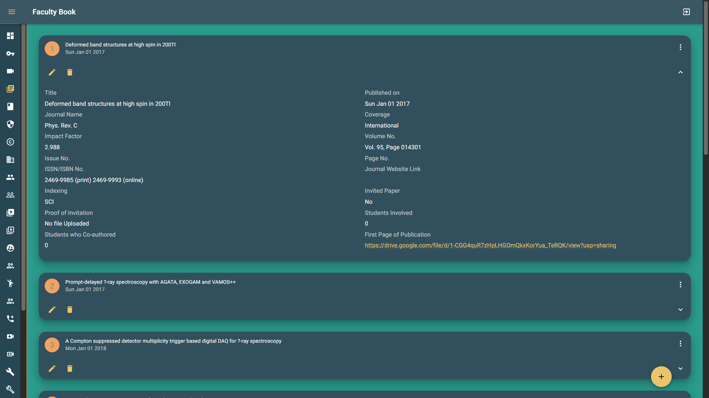

<a name="readme-top"></a>

<!-- [![Contributors][contributors-shield]][contributors-url] -->
<!-- [![Forks][forks-shield]][forks-url] -->
<!-- [![Stargazers][stars-shield]][stars-url] -->
<!-- [![Issues][issues-shield]][issues-url] -->
<!-- [![MIT License][license-shield]][license-url] -->
<!-- [![LinkedIn][linkedin-shield]][linkedin-url] -->

<!-- PROJECT LOGO -->
<br />
<div align="center">
  <!-- <a href="https://github.com/othneildrew/Best-README-Template">
    
  </a> -->

  <h3 align="center">FACULTY BOOK</h3>

  <p align="center">
    <b>An awesome ERP app!</b>
    <br />

<!-- ABOUT THE PROJECT -->

## About The Project

[![FACULTY BOOK Screen Shot][product-screenshot]](https://bsh.iem.edu.in)

This a dedicated College ERP web app, sepcially tailored for use in IEM Kolkata.

It stores all faculty information and publications in cloud, and provides easy report generation and complex filtering and sorting metrics based on 200+ options.

<p align="right">(<a href="#readme-top">back to top</a>)</p>

### Built With

It is a standalone nextjs web-app with mongodb as the database.

- [![Next][next.js]][next-url]
- [![MongoDB][mongodb]][mongodb-url]
- [![MongoDB][typescript]][typescript-url]
- [![Material UI][mui]][mui-url]
- [![AWS][aws]][aws-url]

<p align="right">(<a href="#readme-top">back to top</a>)</p>

<!-- GETTING STARTED -->

## Getting Started

Note on how to setup this project.

### Prerequisites

You will need nodejs and yarn pre-installed to run the development setup, nothing more.

- npm
  ```sh
  npm install yarn -g
  ```

You will need docker or other cloud cli if you want to host this on your own.
The original app that the college uses is in `gitlab` and the CI/CD is maintained over there.

### Installation

Please use yarn to install deps and nto npm or pnpm, etc.

1. Clone the repo
   ```sh
   git clone https://github.com/notfathomless/department-management.git
   ```
1. Install NPM packages
   ```sh
   yarn install
   ```
1. Populate the environment variables in `server/.env`
   TODO:
   List of environments variables.

<p align="right">(<a href="#readme-top">back to top</a>)</p>

<!-- USAGE EXAMPLES -->

## Usage

<h3>App LOGIN</h3>

<br/>
<h3>ADMIN DASHBOARD</h3>

<br/>
<h3>FACULTY PROFILE</h3>

<br/>
<h3>FACULTY ACHIEVEMENT</h3>

<br/>

<p align="right">(<a href="#readme-top">back to top</a>)</p>

<!-- CONTRIBUTING -->

## Contributing

If you have a suggestion that would make this better, please fork the repo and create a pull request. You can also directly ping me at [saikatdey2100@gmail.com](saikatdey2100@gmail.com)! Thanks again!

1. Fork the Project
2. Create your Feature Branch (`git checkout -b feature/AmazingFeature`)
3. Commit your Changes (`git commit -m 'Add some AmazingFeature'`)
4. Push to the Branch (`git push origin feature/AmazingFeature`)
5. Open a Pull Request

<p align="right">(<a href="#readme-top">back to top</a>)</p>

<!-- LICENSE -->

## License

Distributed under the AGPL License. See `LICENSE.txt` for more information.

<p align="right">(<a href="#readme-top">back to top</a>)</p>

<!-- CONTACT -->

## Contact

Saikat Dey - [linkedin](https://www.linkedin.com/in/fathomless/) - saikatdey@example.com

Project Link: [https://github.com/notfathomless/department-management](https://github.com/notfathomless/department-management)

<p align="right">(<a href="#readme-top">back to top</a>)</p>

<!-- ACKNOWLEDGMENTS -->

## Acknowledgments

Use this space to list resources you find helpful and would like to give credit to. I've included a few of my favorites to kick things off!

- [Img Shields](https://shields.io)
- [Vercel](https://vercel.com)
- [material UI](https://mui.com/)

<p align="right">(<a href="#readme-top">back to top</a>)</p>

<!-- MARKDOWN LINKS & IMAGES -->
<!-- https://www.markdownguide.org/basic-syntax/#reference-style-links -->

[forks-shield]: https://img.shields.io/github/forks/othneildrew/Best-README-Template.svg?style=for-the-badge
[forks-url]: https://github.com/othneildrew/Best-README-Template/network/members
[stars-shield]: https://img.shields.io/github/stars/othneildrew/Best-README-Template.svg?style=for-the-badge
[stars-url]: https://github.com/othneildrew/Best-README-Template/stargazers
[issues-shield]: https://img.shields.io/github/issues/othneildrew/Best-README-Template.svg?style=for-the-badge
[issues-url]: https://github.com/othneildrew/Best-README-Template/issues
[license-shield]: https://img.shields.io/github/license/othneildrew/Best-README-Template.svg?style=for-the-badge
[license-url]: https://github.com/othneildrew/Best-README-Template/blob/master/LICENSE.txt
[linkedin-shield]: https://img.shields.io/badge/-LinkedIn-black.svg?style=for-the-badge&logo=linkedin&colorB=555
[linkedin-url]: https://linkedin.com/in/othneildrew
[product-screenshot]: assets/FACULTY_ACHIEVEMENT.jpg
[next.js]: https://img.shields.io/badge/next.js-000000?style=for-the-badge&logo=nextdotjs&logoColor=white
[next-url]: https://nextjs.org/
[mongodb]: https://img.shields.io/badge/MongoDB-4EA94B?style=for-the-badge&logo=mongodb&logoColor=white
[mongodb-url]: https://www.mongodb.com/
[typescript]: https://img.shields.io/badge/TypeScript-007ACC?style=for-the-badge&logo=typescript&logoColor=white
[typescript-url]: https://www.typescriptlang.org/
[mui]: https://img.shields.io/badge/Material--UI-0081CB?style=for-the-badge&logo=material-ui&logoColor=white
[mui-url]: https://mui.com
[aws]: https://img.shields.io/badge/Amazon_AWS-232F3E?style=for-the-badge&logo=amazon-aws&logoColor=white
[aws-url]: https://aws.amazon.com/

